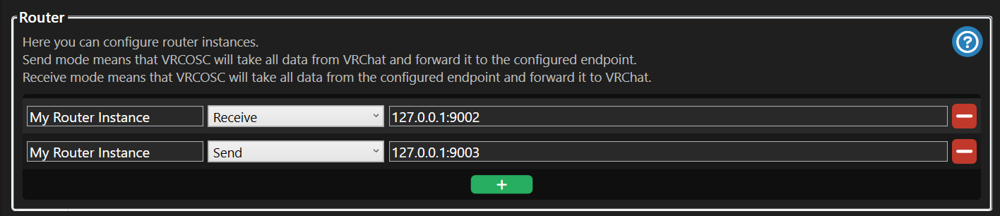

# Gligers' vrchat-osc-scripts

> A set of scripts to interact with VRChat via OSC, 
> currently supporting sending a shock to the [PiShock API](https://www.pishock.com/) when the tail is grabbed.

---

## Prerequisites

- [Python](https://www.python.org/)
- [Git](https://git-scm.com/)
- A [Bash](https://www.gnu.org/software/bash/) or compatible shell (e.g. Terminal, Git Bash, WSL, or PowerShell with adjustments)

---

## Installation (Project Side)

1. Clone the project:
    ```bash
    git clone https://github.com/Gliger13/vrchat-osc-scripts.git
    ```

2. Navigate into the project directory:
    ```bash
    cd vrchat-osc-scripts
    ```

3. Create a virtual Python environment:
    ```bash
    python -m venv .venv
    ```

4. Activate the virtual environment:
    - On Windows:
        ```bash
        .venv\Scripts\activate
        ```
    - On Unix or MacOS:
        ```bash
        source .venv/bin/activate
        ```

5. Install Poetry (Python package management):
    ```bash
    pip install poetry
    ```

6. Install the project dependencies:
    ```bash
    poetry install
    ```

---

## Installation (Unity Side)

In Unity:
- Add `"tail"` as the **PhysBone name** on the tail object.
- This allows the script to detect the `tail_isGrabbed` signal via OSC and trigger an action (shock via PiShock).

Alternatively, change the PhysBone name in the [configuration file](#configuration) to match your setup.


---

## Usage

Run the script with your PiShock credentials:

```bash
PISHOCK_USERNAME="<pishock-username>" \
PISHOCK_API_KEY="<pishock-api-key>" \
PISHOCK_CODE="<pishock-code>" \
python vrchat_osc_scripts/main.py
````

---

## Configuration

Most configuration options can be found and modified in:

[vrchat_osc_scripts/config.py](vrchat_osc_scripts/config.py)

> ⚠️ **Please don't forget to use the correct VRChat OSC ports for this script to function properly.**

You can run multiple OSC-enabled programs simultaneously by using an OSC routing tool such as [VRCOSC](https://github.com/VolcanicArts/VRCOSC).

The current configuration is set up with the following routes in **VRCOSC**:

