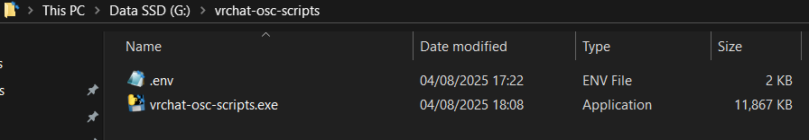
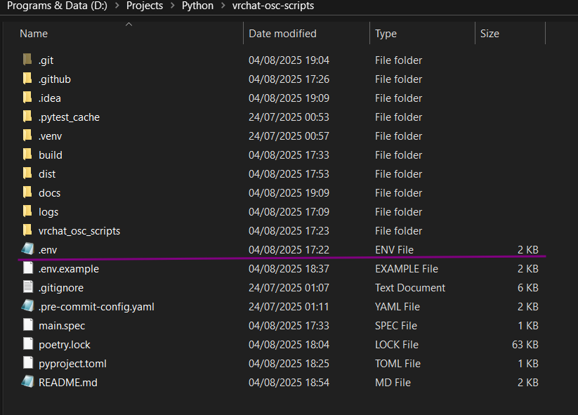
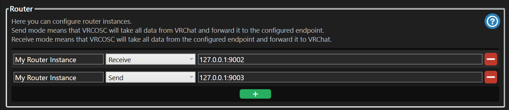
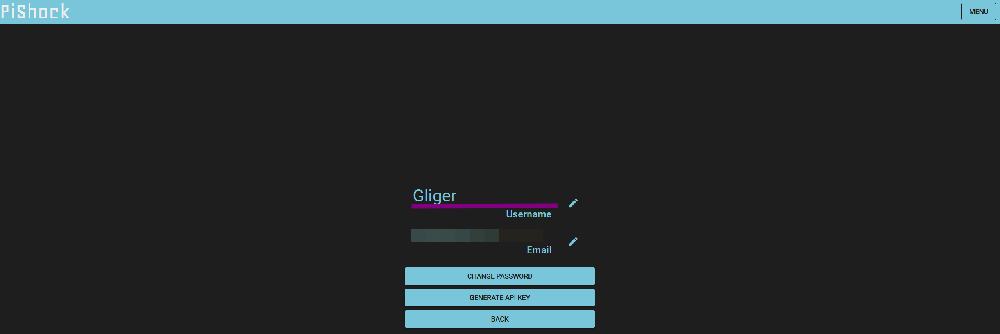
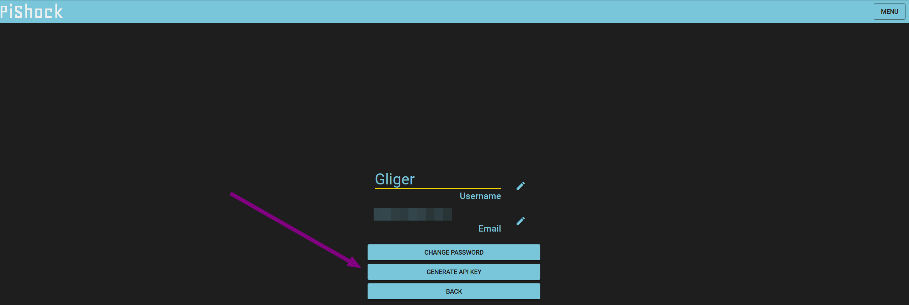
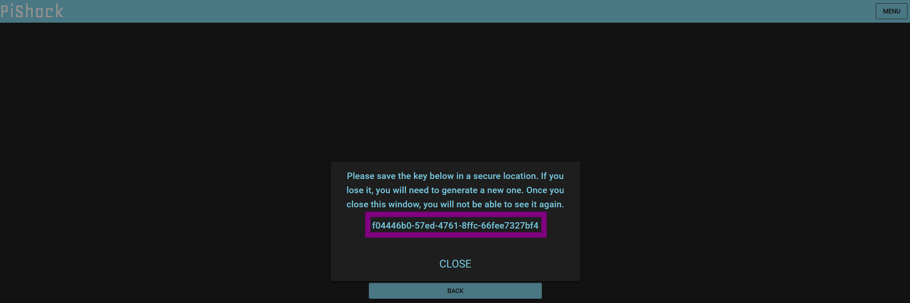
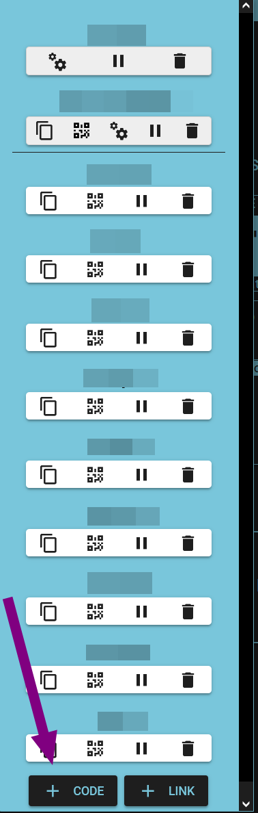
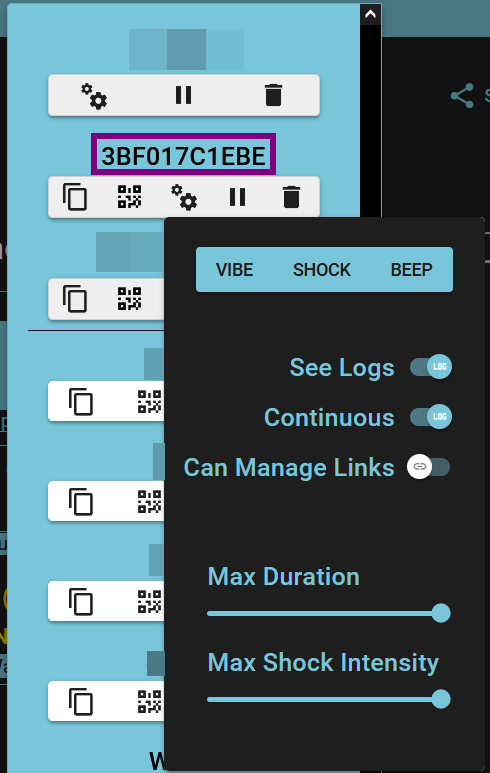

# vrchat-osc-scripts configuration

## Table of Contents

- [vrchat-osc-scripts configuration](#vrchat-osc-scripts-configuration)
  - [Configuration sources](#configuration-sources)
  - [.env file](#env-file)
  - [Configuration](#configuration)
    - [VRChat OSC ports](#vrchat-osc-ports)
    - [PiShock authentication](#pishock-authentication)
    - [Tail Grab Detection & Shock Parameters configuration](#tail-grab-detection--shock-parameters-configuration)

## Configuration sources

You can configure script via:
- `.env` file
- Environment variables (available only if installed using [python way](installation-python.md) the same set of parameters as in `.env`)
- Modifying python files like [config file](../vrchat_osc_scripts/config.py) directly
  (only if installed using [python way](installation-python.md))

## .env file

`.env` is the main configuration file that **MUST BE** located either at the same level as the executable
or in the current working directory.

If the file is not found, the default configuration listed in the
[config file](https://github.com/Gliger13/vrchat-osc-scripts/blob/main/vrchat_osc_scripts/config.py)
will be used.

You can create the `.env` file simply by downloading the
[example .env file](https://github.com/Gliger13/vrchat-osc-scripts/blob/main/.env.example)
and renaming it to `.env`.

If you use the [executable installation](installation-executable.md),
the file location should look like this:



If you installed the scripts using [Python](installation-python.md),
then the file location should look like this:




## Configuration

### VRChat OSC ports

If you are using any other VRChat OSC applications, such as:
- VRCOSC
- Face tracking apps
- Eye tracking apps
- OSCGoesBrr
- Or anything else that uses OSC,

you **will most likely need to change** the script’s ports to avoid conflicts.
If you don’t use any other VRChat apps, you can skip this step, as the default ports should work fine.

If you don’t have any VRChat port router application, you can use [VRCOSC](https://github.com/VolcanicArts/VRCOSC)
and set up the following routes:



Once done, update the following parameters in your `.env` file:

```dotenv
VRCHAT_OSC_RECEIVE_PORT=9003
VRCHAT_OSC_SEND_PORT=9002

```

When you run VRCOSC, it will automatically route the ports for the script to work properly.

### PiShock authentication

In order for the script to send shocks to your device, it needs the following:

1. **Your PiShock Username**
   You can grab it from [here](https://pishock.com/#/account) after logging in - it's in the username box.

   

   Put it into the `.env` file as `PISHOCK_USERNAME`.

2. **Your PiShock API Key**
   You can generate it from [here](https://pishock.com/#/account) by clicking on “Generate API Key.”

   
   

   Put it into the `.env` file as `PISHOCK_API_KEY`.

3. **Your PiShock Token**
   You can generate a new one [here](https://pishock.com/#/control). Click **Code** and it will appear at the top.

   
   

   **WARNING: ALWAYS SET LIMITS THAT THE SCRIPT SHOULD NOT EXCEED. I TRUST MYSELF, BUT YES.**

   Put it into the `.env` file as `PISHOCK_TOKEN`.

### Tail Grab Detection & Shock Parameters configuration

This section describes the most important parts like shock intensity, duration, and cooldown.
Everything is self-explanatory.

```dotenv
# === Tail Grab Detection & Shock Parameters ===
# Name of the parameter in the tail's PhysBone component (used for detecting grabs)
AVATAR_TAIL_PARAMETER_NAME=tail
# Static shock intensity (range: 1–100) applied when the tail grab is released
# Will implement randomized or stretch-based intensity in the future
SHOCK_INTENSITY_ON_TAIL_GRAB=1
# Duration of the shock in seconds
SHOCK_DURATION_ON_TAIL_GRAB=1
# Cooldown time in seconds between shocks to prevent spamming
SHOCK_COOLDOWN_TIME=30
# Maximum allowed shock intensity as a safety safeguard (prevents accidental overdrive)
MAX_SHOCK_INTENSITY_SAFE_GUARD=80
# Message sent to the VRChat chatbox once a shock is delivered
SHOCK_MESSAGE="⚡️"
```

I might add more parameters soon.
