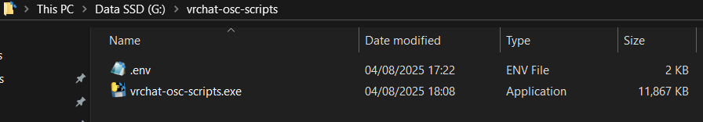

# vrchat-osc-scripts executable installation

This doc will guide you how to run scripts using executble aka .exe file.

## Installation Steps

1) Go to https://github.com/Gliger13/vrchat-osc-scripts/releases/latest

2) Download `vrchat-osc-scripts.ext` file

3) Go to https://github.com/Gliger13/vrchat-osc-scripts/blob/main/.env.example

4) Click download raw file

5) Create somewhere a `vrchat-osc-scripts` directory or use any other name you prefer

4) Move the downloaded files to the newly created folder

5) Rename `.env.example` to `.env`

At the current step, your setup should look like this:

## Configuration

Configure `.env` file values by opening it any text editor,
follow [configuration](configuration.md) and [unity installation step](installation-unity.md) guides

## Usage

Once the `.env` file is populated correctly, you can try running the `.exe` file.

**WARNING:** Windows Defender will likely throw an alert that the executable has an unknown publisher.
This is expected - resolving it would require code signing, which involves a paid certificate...
Check the [EXE creation process](#exe-creation-process) if you want to understand what kind of "animal" you're trying to execute.

## Troubleshooting

Uhh... good luck!

Hopefully, it works as-is. If not, check the logs folder or the console to see why it failed.

## .exe Creation Process

The whole process of building the `.exe` file is transparent:

* All source files are listed in the Git repository under a specific tag
  (e.g. https://github.com/Gliger13/vrchat-osc-scripts/tree/v0.2.4)
* The workflow for building the `.exe` file using [PyInstaller](https://pyinstaller.org/en/stable/) is available here:
  https://github.com/Gliger13/vrchat-osc-scripts/blob/main/.github/workflows/make-release.yml
* Once I push a Git tag, it will automatically build the `.exe` file and publish it to releases.
  The build process runs on GitHub's side, and you can check the logs and verify SHA256 checksums (e.g.
  https://github.com/Gliger13/vrchat-osc-scripts/actions/runs/16728649919/job/47350952775)
