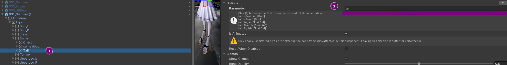

# vrchat-osc-scripts installation from Unity side

For VRChat OSC to notify the vrchat-osc-scripts whether the physbone was grabbed or not,
you need to configure a parameter name in the physbone component on your avatar.

1) Go to Unity
2) Open you avatar
3) Locate the physbone component that should trigger a shock when grabbed or released
4) Open the component’s options
5) Set the parameter name to `tail`. (If the parameter is set to something else,
   you can change the script configuration parameter `AVATAR_TAIL_PARAMETER_NAME` to match your existing parameter.
   For more details, see the [Configuration Guide](configuration.md).)
6) Upload your avi

This allows the script to detect the `tail_isGrabbed` signal via OSC and trigger an action (shock via PiShock).

